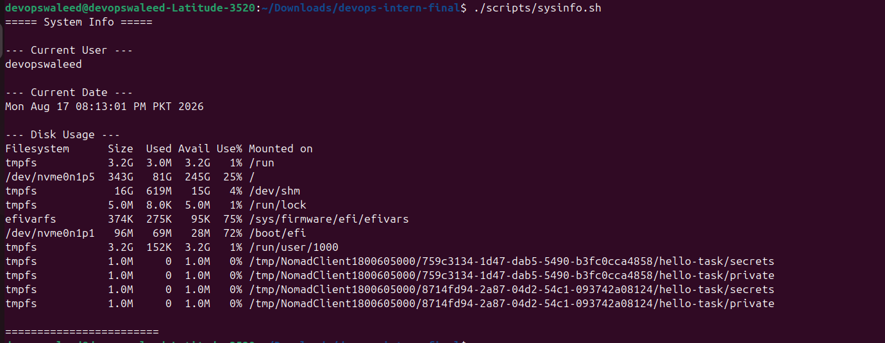
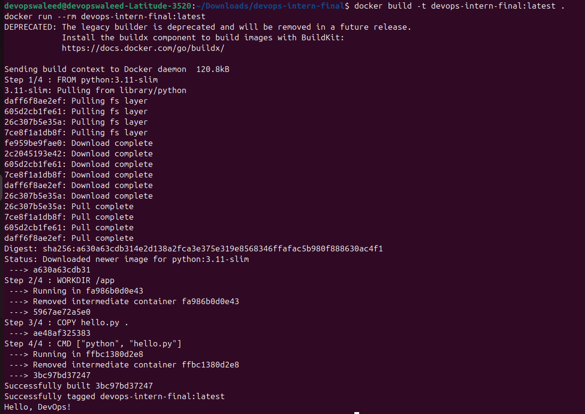
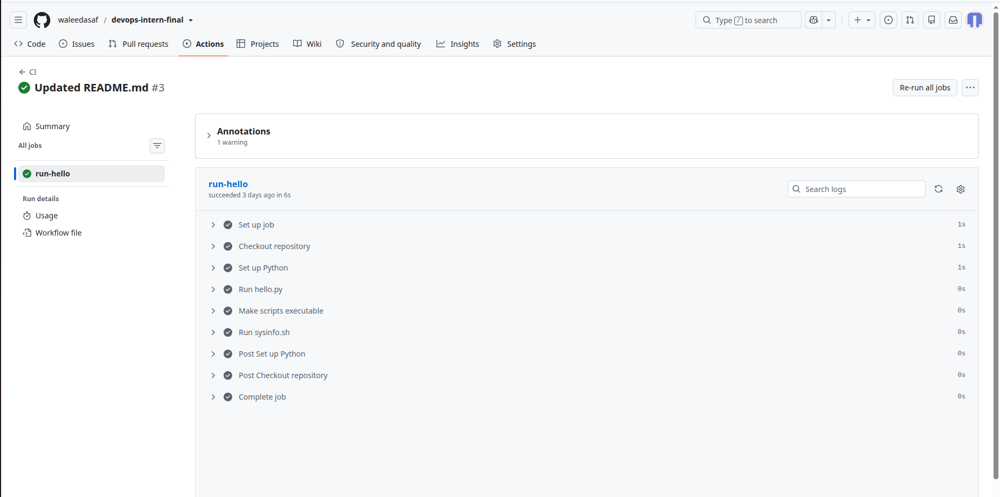
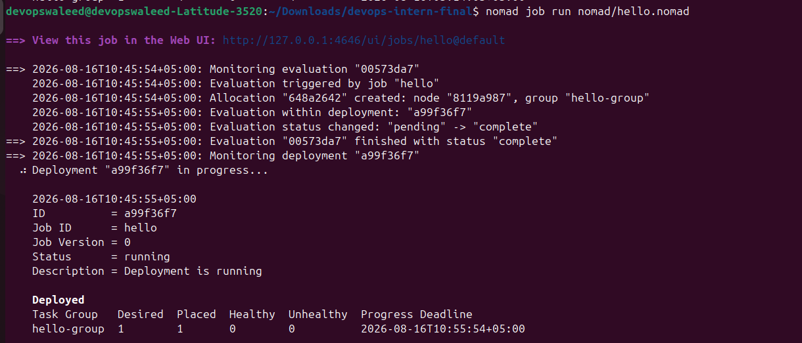
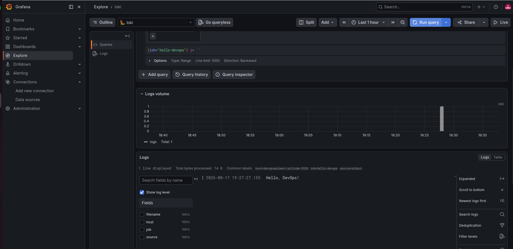
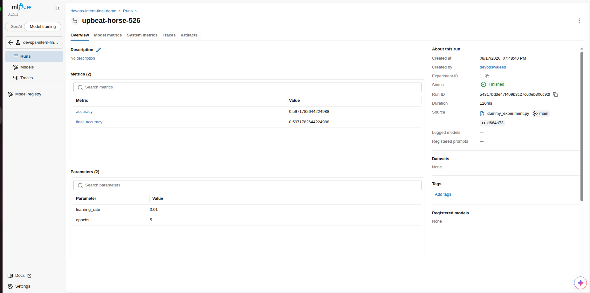

# DevOps Intern Final Assessment

**Name:** Muhammad Waleed Asaf
**Date:** 2026-08-13

[](https://github.com/waleedasaf/devops-intern-final/actions/workflows/ci.yml)

## Project Description

This repository is a small, end-to-end DevOps pipeline built to demonstrate
core skills covered during the internship: Linux/shell scripting, Git &
GitHub, Docker, CI/CD with GitHub Actions, job scheduling with HashiCorp
Nomad, and log monitoring with Grafana Loki. Each step produces a concrete
artifact that feeds into the next step, simulating a realistic (if scaled
down) DevOps workflow.

---

## 1. Git & GitHub Setup

- `hello.py` — a minimal script that prints `Hello, DevOps!`.
- This `README.md` documents every step below.

Run it directly:

```bash
python hello.py
```

**Proof:** public repository at
[github.com/waleedasaf/devops-intern-final](https://github.com/waleedasaf/devops-intern-final)
showing `README.md`, `hello.py`, and the rest of the project files.

*(Add a screenshot of the GitHub repo file listing here —
`screenshots/github-repo.png` — before submitting.)*

---

## 2. Linux & Scripting Basics

`scripts/sysinfo.sh` prints:

- The current user (`whoami`)
- The current date (`date`)
- Disk usage (`df -h`)

Make it executable and run it:

```bash
chmod +x scripts/sysinfo.sh
./scripts/sysinfo.sh
```

Sample output:

```
===== System Info =====

--- Current User ---
devopswaleed

--- Current Date ---
Mon Aug 17 08:13:01 PM PKT 2026

--- Disk Usage ---
Filesystem      Size  Used Avail Use% Mounted on
tmpfs           3.2G  3.0M  3.2G   1% /run
/dev/nvme0n1p5  343G   81G  245G  25% /
...

========================
```



---

## 3. Docker Basics

`Dockerfile` containerizes `hello.py`:

```dockerfile
FROM python:3.11-slim
WORKDIR /app
COPY hello.py .
CMD ["python", "hello.py"]
```

Build and run locally:

```bash
docker build -t devops-intern-final:latest .
docker run --rm devops-intern-final:latest
```

Expected output:

```
Hello, DevOps!
```



---

## 4. CI/CD with GitHub Actions

`.github/workflows/ci.yml` runs on every push/PR to `main` and:

1. Checks out the repo
2. Sets up Python 3.11
3. Runs `python hello.py`
4. Runs `scripts/sysinfo.sh`

The badge at the top of this README reflects the latest run status.



---

## 5. Job Deployment with Nomad

`nomad/hello.nomad` runs the Docker image built in Step 3 as a Nomad
`service` job with minimal resources (100 MHz CPU / 128 MB memory).

To run it (requires a local Nomad agent in dev mode and Docker):

```bash
# Start a local dev Nomad agent in a separate terminal
sudo nomad agent -dev

# Make sure the image referenced in the job file has been built
docker build -t devops-intern-final:latest .

# Submit the job
nomad job run nomad/hello.nomad

# Check status / logs
nomad job status hello
nomad alloc logs <ALLOC_ID>
```



> **Note:** because `hello.py` prints one line and exits immediately, a
> `service`-type Nomad job will keep restarting the allocation after the
> first successful run (Nomad expects a service task to stay running).
> The screenshot above captures the initial successful deployment; the
> restart behavior on later runs is expected given the one-shot nature of
> `hello.py` rather than an actual failure of the pipeline. For a
> production job you'd either use `type = "batch"` for one-shot tasks or
> change `hello.py` to run as a long-lived process.

---

## 6. Monitoring with Grafana Loki

See [`monitoring/loki_setup.txt`](monitoring/loki_setup.txt) for the full
write-up, which covers:

- How Loki was started locally via Docker
- How container/Nomad allocation logs are forwarded to Loki (Docker's
  Loki logging driver, or a Promtail sidecar for Nomad allocations)
- The exact commands used to query and view logs (via `logcli`, the
  Grafana Explore UI, or the raw Loki HTTP API)



---

## 7. Extra Credit — MLflow Tracking

`mlflow/dummy_experiment.py` logs a dummy experiment (fake hyperparameters
and an accuracy curve) to MLflow for practice with experiment tracking.

```bash
pip install mlflow
python mlflow/dummy_experiment.py
mlflow ui   # open http://localhost:5000 to view the run
```



---

## Repository Structure

```
devops-intern-final/
├── README.md
├── hello.py
├── Dockerfile
├── scripts/
│   └── sysinfo.sh
├── .github/
│   └── workflows/
│       └── ci.yml
├── nomad/
│   └── hello.nomad
├── monitoring/
│   └── loki_setup.txt
├── mlflow/
│   └── dummy_experiment.py
└── screenshots/
    ├── github-repo.png
    ├── sysinfo-output.png
    ├── docker-build-run.png
    ├── github-actions-ci.png
    ├── nomad-job-run.png
    ├── grafana-loki-logs.png
    └── mlflow-run.png
```

## How to Run Everything End-to-End

```bash
# 1. Clone the repo
git clone https://github.com/waleedasaf/devops-intern-final.git
cd devops-intern-final

# 2. Run the basics
python hello.py
chmod +x scripts/sysinfo.sh && ./scripts/sysinfo.sh

# 3. Containerize and run
docker build -t devops-intern-final:latest .
docker run --rm devops-intern-final:latest

# 4. Push to GitHub -> GitHub Actions runs hello.py and sysinfo.sh automatically

# 5. Deploy with Nomad (requires local Nomad + Docker)
nomad agent -dev &
nomad job run nomad/hello.nomad

# 6. Monitor logs with Loki (see monitoring/loki_setup.txt for full detail)
docker run -d --name=loki -p 3100:3100 grafana/loki:2.9.0 -config.file=/etc/loki/local-config.yaml

# 7. (Optional) Track a dummy experiment with MLflow
python mlflow/dummy_experiment.py
```
